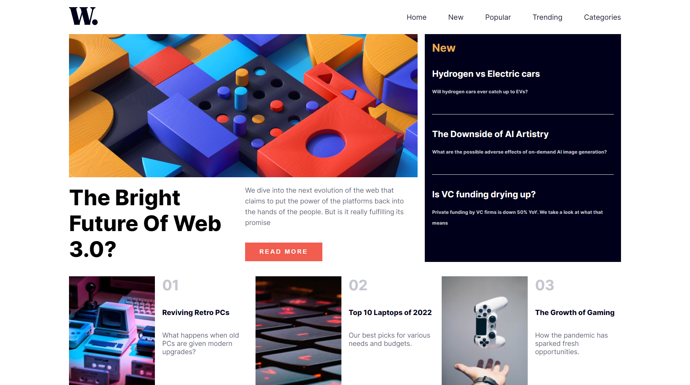

# Frontend Mentor - News homepage solution

This is a solution to the [News homepage challenge on Frontend Mentor](https://www.frontendmentor.io/challenges/news-homepage-H6SWTa1MFl). Frontend Mentor challenges help you improve your coding skills by building realistic projects.

## Table of contents

- [Overview](#overview)
  - [The challenge](#the-challenge)
  - [Screenshot](#screenshot)
  - [Links](#links)
- [My process](#my-process)
  - [Built with](#built-with)
  - [What I learned](#what-i-learned)
  - [Continued development](#continued-development)
  - [Useful resources](#useful-resources)
- [Author](#author)
- [Acknowledgments](#acknowledgments)

## Overview

### The challenge

Users should be able to:

- View the optimal layout for the interface depending on their device's screen size
- See hover and focus states for all interactive elements on the page

### Screenshot



### Links

- Solution URL: https://github.com/swiTTcHH/frontendmentorchallenges
- Live Site URL: https://news-homepage-100.netlify.app/

## My process
During the course of this challenge, I had to learn, unlearn and relearn a few things. I am mostly a greenhorn in the developer world, but with this project, I believe that I am one step closer to betterment(I don't believe in mastery).

I could not work completely with semantic components so I decided not to. Instead, I started out by laying divs all over the place 😂. Sometimes, the solution to the hardest problem is going back to the basics. With the divs, I was able to create the layout for the challenge that looked as similar as I could get it. Then I was able to change all the divs to semantic components and with that, I had my solution. I look forward to taking up more challenges

### Built with

- Semantic HTML5 markup
- CSS custom properties
- Flexbox
- CSS Grid
- JavaScript

### What I learned

- I learned to use CSS grid to display, position items and create layouts.

```CSS
.gridtem{  display: grid;
  grid-template-columns: 1fr 1fr;
  place-content: center;
  align-items: center;
}
```

- At the beginning of and at the time of completion, I had no idea how to use git & github. I finished the project ages ago, but had exams in school and didn't even know how to deploy it. Pardon me if it doesn't look too good or professional, I am getting there, I promise.

- From countless youtube shorts and videos I saw during the course of the project, I was able to learn how to use CSS variables. It really helped. Rather than having to remember the color code, just put them into a variable that you can call at any time
```CSS
:root {
  --softorange: hsl(35, 77%, 62%);
  --darkblue: hsl(240, 100%, 5%);
}
```

- At some point, I learnt that your keyboard keys have KEYCODES which can be used or targeted with JavaScript
```JS
if (e.keyCode === 27) {
         console.log("This is the keycode for the ESC key");
        }
```

### Continued development
I'm still learning to use Git/Github, CSS Variables and Grid templates. I hope to one day be confident in using them

### Useful resources

- Kalob Taulien's Fullstack web developer's course(https://www.udemy.com/share/101Wlg3@0WIU2rnDje7PEFpzf7lhVHlDgl6pVTutTSRFZlW0S0sDFnS7zIvWfFWL7_xnlixRqg==/) - a useful udemy course I've been using to learn everything web development. It's a bit outdated but still very useful

- Kevin Powell's Youtube channel (https://youtube.com/@KevinPowell) - In my opinion, this man is a CSS god. Honestly, your one stop shop and best choice for all things CSS related.

## Author

- Frontend Mentor - [@swiTTcHH](https://www.frontendmentor.io/profile/swiTTcHH)
- Twitter - [@jed_i_di_ah](https://twitter.com/jed_i_di_ah)
